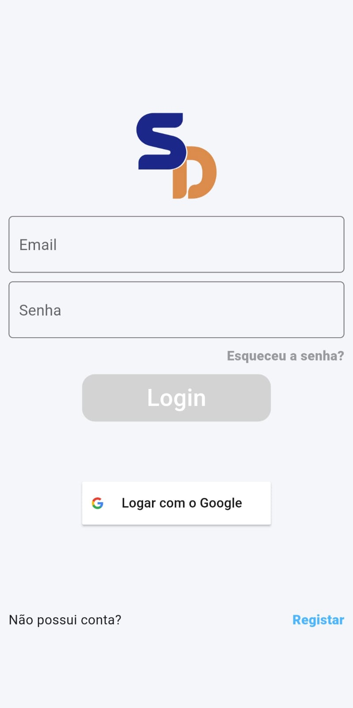
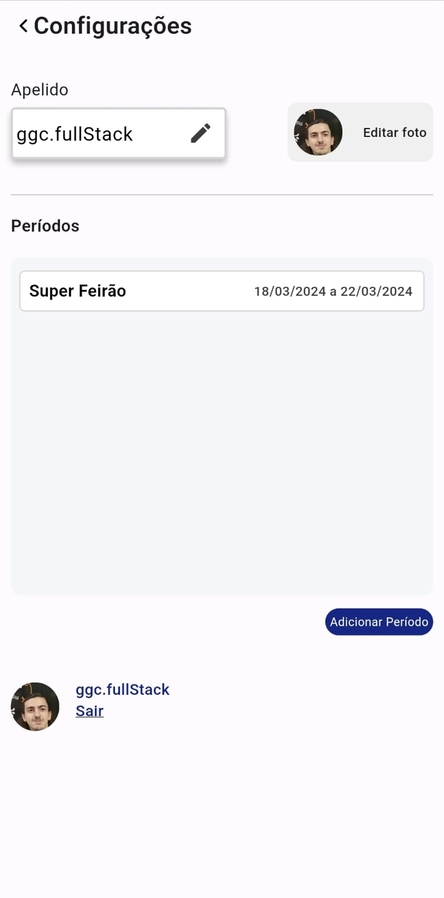
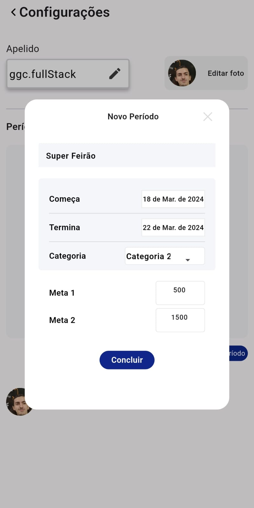
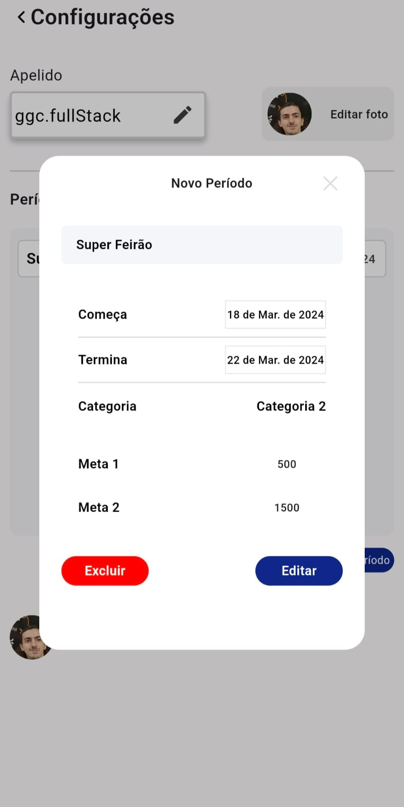

# sd_task

## Features

- Login com firebaseAuth e Google;
- Dados salvo no [banco de dados do firebase](https://firebase.google.com/docs/firestore?hl=pt-br)
- Clean achitecture
- Gerenciamento de stado com [MobX](https://pub.dev/packages/mobx) e [BLoC](https://pub.dev/packages/flutter_bloc)
- Utilização do fundamento [DRY](https://en.wikipedia.org/wiki/Don%27t_repeat_yourself) (Don't Repear Yourself ou "Não repita a si mesmo"), que por meio da componentização de elementos que se repetem ao longo do código evita retrabalhos e facilita em futuras modificações;

## Screenshots

## Usabilidade

- ### Para alterar seu Apelido, basta clicar no icone de editar, digitar o novo apelido desejado e salvar.

- - ###### O icone de salvar é desativado caso o apelido seja vázio, impedindo que o apelido seja null
- - ###### A API só é chamada se houver mudança no apelido, diminuindo carregamentos desncessários.

---

- ### Para editar a foto de perfil, basta clicar em "editar foto" e escolher uma nova foto a partir da sua galeria.

---

- ### Ao clicar duas vezes em um card de período, é possível abri-lo para uma melhor visualização ou edição de seus dados.
